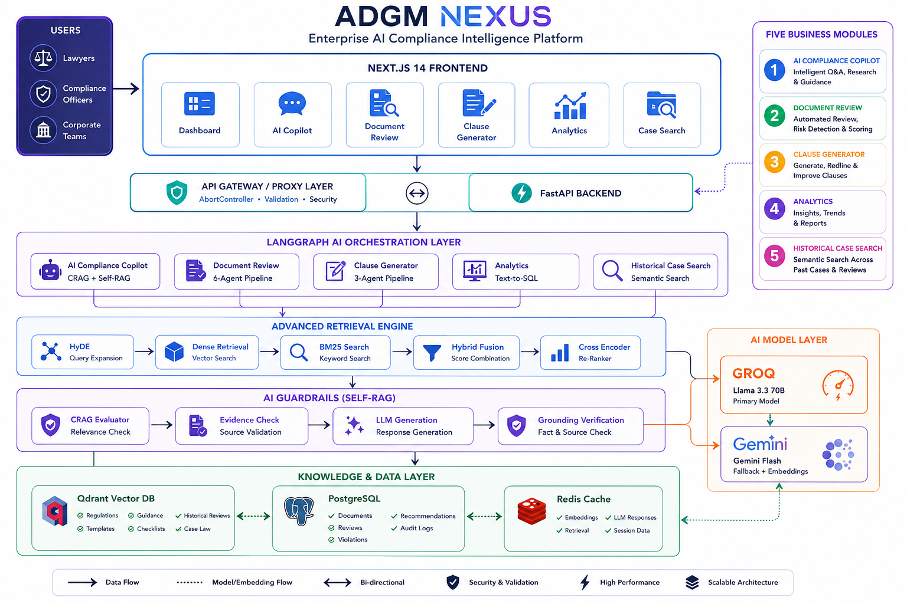

# ADGM Nexus

<p align="center">
  
  
  
  
  
  
  
</p>

<p align="center">
  <h3 align="center">
    Enterprise AI Compliance Intelligence Platform for Abu Dhabi Global Market (ADGM)
  </h3>
</p>

<p align="center">
  Multi-Agent AI • RAG • CRAG • Self-RAG • Compliance Review • Analytics • Clause Generation
</p>

---

## Overview

ADGM Nexus is an enterprise-grade AI compliance intelligence platform built specifically for organizations operating within the Abu Dhabi Global Market (ADGM).

The platform combines:

- Retrieval-Augmented Generation (RAG)
- Hybrid Retrieval
- Multi-Agent LangGraph Workflows
- Compliance Auditing
- Regulatory Knowledge Search
- Clause Generation
- Natural Language Analytics
- Historical Case Search

to help compliance officers, legal teams, and organizations work with ADGM regulations more efficiently.

---

# 🎥 Watch Demo

> Replace with your uploaded video URL

**Demo Video**

[Watch Demo Here](https://your-demo-link.com)

---

# 🏗 Architecture

The complete system architecture is shown below.

<p align="center">
  
</p>

---

# ✨ Features

## AI Compliance Copilot

Ask compliance questions in natural language and receive grounded answers with source citations.

### Example Questions

```text
What are ADGM UBO disclosure requirements?

Can an ADGM company have a single director?

What documents are required for incorporation?
```

### Capabilities

- Citation-backed answers
- Multi-collection retrieval
- CRAG
- Self-RAG
- Hallucination prevention
- Source attribution

---

## Document Review & Compliance Audit

Upload legal documents and receive:

- Compliance Score
- Executive Summary
- Violation Detection
- Gap Analysis
- Recommendations
- Regulatory Citations
- Similar Historical Cases

### Supported Documents

- Articles of Association (AoA)
- Memorandum of Association (MoA)
- Employment Contracts
- Board Resolutions
- Shareholder Resolutions
- UBO Declarations
- Share Purchase Agreements

---

## Clause Generator

Generate ADGM-compliant legal clauses.

### Examples

```text
Draft an arbitration clause.

Generate a board quorum clause.

Create a share capital provision.
```

---

## Compliance Analytics

Ask questions about compliance data in plain English.

### Examples

```text
How many violations were found this month?

Which document type has the most violations?

What is the average compliance score?
```

### Pipeline

Natural Language
↓
Generate SQL
↓
Validate SQL
↓
Execute SQL
↓
Generate Narrative Insights

---

## Historical Case Search

Find similar compliance reviews using semantic similarity search.

### Examples

```text
Find AoA reviews with UBO violations.

Show employment contracts with probation issues.

Find reviews similar to this document.
```

---

# 🚀 Technology Stack

## Frontend

- Next.js 14
- React
- TypeScript
- Tailwind CSS
- React Markdown
- Lucide React
- React Dropzone

## Backend

- FastAPI
- Python 3.12
- SQLAlchemy
- Pydantic
- LangGraph

## AI & Retrieval

- Groq (Llama 3.3 70B)
- Gemini 2.0 Flash
- Gemini Embeddings
- CRAG
- Self-RAG
- HyDE
- Hybrid Retrieval
- BM25
- Cross Encoder Re-Ranking

## Databases

- PostgreSQL
- Qdrant
- Redis

## Infrastructure

- Docker
- Docker Compose
- uv

---

# 🧠 Core Architecture

```text
User
 │
 ▼
Next.js Frontend
 │
 ▼
FastAPI Backend
 │
 ▼
LangGraph Multi-Agent Orchestration
 │
 ├── Compliance Chat
 ├── Document Review
 ├── Clause Generator
 ├── Analytics
 └── Case Search
 │
 ├── Groq LLM
 ├── Gemini Fallback
 ├── Redis Cache
 ├── PostgreSQL
 └── Qdrant
```

---

# 🔍 Retrieval Architecture

```text
User Query
    │
    ▼
HyDE
    │
    ▼
Dense Retrieval (Qdrant)
    │
    ▼
BM25 Retrieval
    │
    ▼
Hybrid Fusion (RRF)
    │
    ▼
Cross Encoder Re-ranking
    │
    ▼
Final Context
    │
    ▼
LLM Generation
```

---

# 🤖 Multi-Agent Pipelines

## Compliance Chat

```text
route_intent
      │
      ▼
retrieve
      │
      ▼
crag_evaluate
      │
      ▼
self_check_evidence
      │
      ▼
generate
      │
      ▼
self_grade_answer
```

---

## Document Review

```text
classify_document
        │
        ▼
extract_clauses
        │
        ▼
retrieve_regulations
        │
        ▼
detect_violations
        │
        ▼
analyse_gaps
        │
        ▼
generate_report
```

---

## Clause Generation

```text
parse_request
      │
      ▼
retrieve_context
      │
      ▼
generate_clause
```

---

## Analytics

```text
generate_sql
      │
      ▼
validate_sql
      │
      ▼
execute_sql
      │
      ▼
format_answer
```

---

# 📂 Project Structure

```text
ADGM_Compliance_Copilot
│
├── backend
│   ├── app
│   │   ├── agent
│   │   ├── api
│   │   ├── core
│   │   ├── db
│   │   ├── models
│   │   ├── repositories
│   │   ├── schemas
│   │   └── services
│   └── main.py
│
├── nextjs-frontend
│   ├── src
│   │   ├── app
│   │   ├── components
│   │   ├── lib
│   │   └── types
│
├── docs
├── scripts
├── tests
├── docker
├── ADGM_NEXUS_Architecture.png
├── README.md
└── pyproject.toml
```

---

# ⚙️ Installation

## Clone Repository

```bash
git clone https://github.com/your-username/adgm-compliance-copilot.git

cd adgm-compliance-copilot
```

## Backend Setup

```bash
uv sync
```

## Frontend Setup

```bash
cd nextjs-frontend

npm install

cd ..
```

## Environment Variables

Create a `.env` file.

```env
GEMINI_API_KEY=your_key

GROQ_API_KEY=your_key

POSTGRES_HOST=localhost
POSTGRES_PORT=5432

QDRANT_HOST=localhost
QDRANT_PORT=6333

REDIS_HOST=localhost
REDIS_PORT=6379
```

---

## Start Infrastructure

```bash
docker compose -f docker/docker-compose.yml up -d
```

Services Started:

- PostgreSQL
- Redis
- Qdrant

---

## Run Migrations

```bash
alembic upgrade head
```

---

## Ingest Knowledge Base

```bash
python scripts/ingest_knowledge_base.py
```

---

## Run Backend

```bash
uvicorn backend.main:app --reload --host 0.0.0.0 --port 8000
```

---

## Run Frontend

```bash
cd nextjs-frontend

npm run dev
```

---

# 🌐 Local URLs

### Frontend

```text
http://localhost:3000
```

### Backend

```text
http://localhost:8000
```

### Swagger Docs

```text
http://localhost:8000/docs
```

---

# 🔌 API Endpoints

| Method | Endpoint | Description |
|----------|----------|-------------|
| POST | `/api/v1/chat` | Compliance Chat |
| POST | `/api/v1/reviews/analyze` | Document Review |
| POST | `/api/v1/generated-clauses/generate` | Clause Generation |
| POST | `/api/v1/analytics/query` | Compliance Analytics |
| POST | `/api/v1/cases/search` | Historical Case Search |
| GET | `/health` | System Health |

---

# 📸 Screenshots

## Dashboard

```text
docs/screenshots/dashboard.png
```

## Compliance Chat

```text
docs/screenshots/chat.png
```

## Document Review

```text
docs/screenshots/review.png
```

## Clause Generator

```text
docs/screenshots/clauses.png
```

## Analytics

```text
docs/screenshots/analytics.png
```

## Case Search

```text
docs/screenshots/cases.png
```

---

# 🎯 Highlights

✅ Enterprise Multi-Agent Architecture

✅ LangGraph Workflows

✅ CRAG

✅ Self-RAG

✅ Hybrid Retrieval

✅ HyDE

✅ BM25

✅ Cross-Encoder Re-Ranking

✅ Compliance Auditing

✅ Natural Language Analytics

✅ Historical Case Search

✅ Redis Caching

✅ PostgreSQL Persistence

✅ Qdrant Vector Search

✅ Production-Ready FastAPI Backend

✅ Modern Next.js Frontend

---

# 🔮 Future Enhancements

- Multi-Jurisdiction Compliance Support
- Regulatory Change Monitoring
- Enterprise SSO
- Human Approval Workflows
- Multi-Document Review
- Compliance Monitoring Dashboard
- Agent Memory

---

# ⚠ Disclaimer

This platform is intended to assist legal and compliance workflows.

Generated outputs should always be reviewed by qualified legal professionals before being relied upon for regulatory or legal decisions.

---

# 📄 License

MIT License

---

<p align="center">
Built with ❤️ using FastAPI • LangGraph • Groq • Gemini • Qdrant • PostgreSQL • Redis • Next.js
</p>