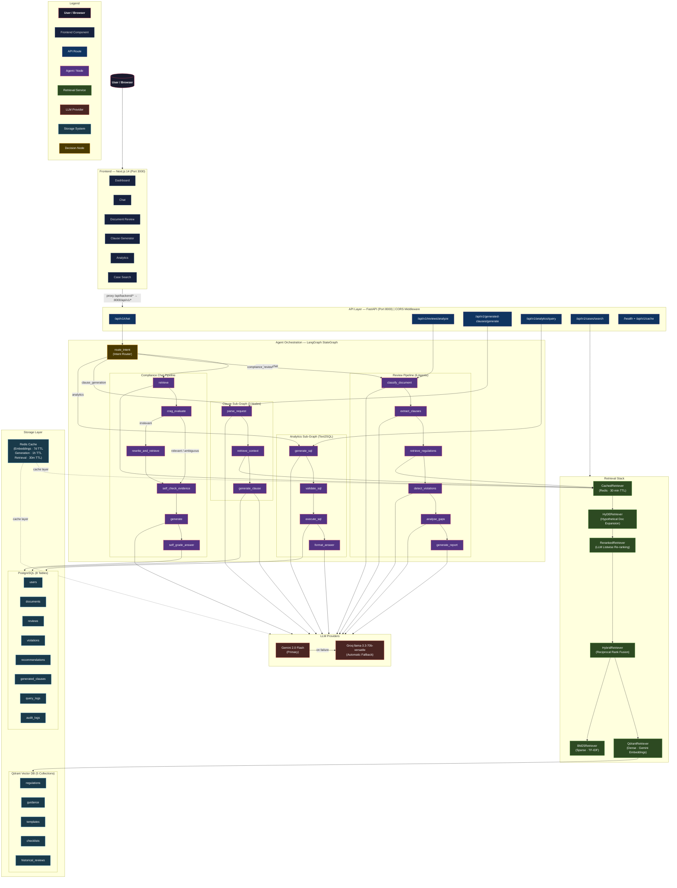

# ADGM Compliance Copilot


**Enterprise AI compliance intelligence platform for the Abu Dhabi Global Market (ADGM)**

---

## Overview

ADGM Compliance Copilot is a full-stack, multi-agent AI platform that gives compliance officers, legal teams, and business owners operating in the ADGM financial free zone instant, regulation-grounded answers to their compliance questions. The platform ingests the complete ADGM regulatory corpus — including the Financial Services and Markets Regulations (FSMR), conduct of business rules (COBS), prudential requirements (PRU), guidance notices, and standard-form templates — into a hybrid vector search engine, then orchestrates a LangGraph multi-agent workflow to answer queries, review documents, draft clauses, and surface analytics.

All answers are grounded in retrieved regulatory text with explicit citations. The system is built to enterprise standards: every query is logged, every reviewed document is indexed for future similarity search, and every LLM call falls back automatically from Gemini to Groq should the primary provider be unavailable.

---

## Architecture Diagram



---

## Core Capabilities

| Capability | Description | Endpoint | Technologies |
|---|---|---|---|
| **Compliance Chat** | Ask natural language questions about ADGM regulations. Answers are grounded in retrieved regulatory text with explicit rule citations and source references. | `POST /api/v1/chat` | LangGraph, CRAG, Self-RAG, Gemini 2.0 Flash, HyDE, Hybrid Retrieval |
| **Document Review** | Upload a PDF or DOCX (Articles of Association, employment contracts, UBO declarations, etc.). A 6-agent AI pipeline classifies the document, extracts clauses, maps them to regulations, detects violations, identifies gaps, and returns a scored compliance report. | `POST /api/v1/reviews/analyze` | LangGraph sub-graph, PyMuPDF, python-docx, Gemini |
| **Clause Generator** | Describe the clause you need in plain English. The system retrieves relevant ADGM regulations and standard-form templates, then drafts a numbered, citation-backed legal clause ready to insert into your document. | `POST /api/v1/generated-clauses/generate` | LangGraph sub-graph, Qdrant templates collection, Gemini |
| **Compliance Analytics** | Ask questions about your compliance history in plain English. The system generates a safe SQL query, optionally runs it against your PostgreSQL database, and returns a narrative answer with the raw data. Supports a human-in-the-loop SQL review step. | `POST /api/v1/analytics/query` | LangGraph Text2SQL sub-graph, SQLAlchemy, PostgreSQL, Gemini |
| **Historical Case Search** | Semantically search the database of past compliance reviews. Finds similar documents, common violations, and frequently cited regulations to benchmark a current review. | `POST /api/v1/cases/search` | Qdrant `historical_reviews` collection, Gemini embeddings |

---

## Tech Stack

| Component | Technology |
|---|---|
| **Frontend Framework** | Next.js 14 (App Router) |
| **Frontend Language** | TypeScript |
| **UI Components** | Tailwind CSS, shadcn/ui |
| **Backend Framework** | FastAPI 0.136 |
| **Backend Language** | Python 3.12 |
| **Agent Orchestration** | LangGraph 1.2 |
| **Primary LLM** | Google Gemini 2.0 Flash |
| **Fallback LLM** | Groq llama-3.3-70b-versatile |
| **Embedding Model** | Gemini embedding-001 |
| **Vector Database** | Qdrant |
| **Relational Database** | PostgreSQL 17 |
| **Cache** | Redis 7 |
| **ORM** | SQLAlchemy 2.0 |
| **Schema Validation** | Pydantic v2 |
| **PDF Extraction** | PyMuPDF |
| **DOCX Extraction** | python-docx |
| **Sparse Retrieval** | rank-bm25 |
| **Dependency Management** | uv |
| **Infrastructure** | Docker Compose |

---

## 16-Phase Build Roadmap

| Phase | Name | Description | Status |
|---|---|---|---|
| 1 | Project Scaffolding | Repository structure, pyproject.toml, uv workspace, Docker Compose for Postgres + Qdrant + Redis | ✅ Complete |
| 2 | Database Models | SQLAlchemy models for users, documents, reviews, violations, recommendations, audit logs, query logs, generated clauses | ✅ Complete |
| 3 | CRUD API Layer | FastAPI generic CRUD router, all 8 resource endpoints registered, Pydantic schemas | ✅ Complete |
| 4 | Knowledge Base Ingestion | Document loaders (PDF, DOCX, Markdown), text chunking, Qdrant collection creation, bulk embedding ingestion | ✅ Complete |
| 5 | Baseline RAG | QdrantRetriever dense search, GeminiClient generation, BaselineRAGPipeline, `/chat` endpoint live | ✅ Complete |
| 6 | Hybrid RAG | BM25Retriever, HybridRetriever with Reciprocal Rank Fusion (RRF), replace baseline in chat pipeline | ✅ Complete |
| 7 | LLM Re-ranking | LLMReranker listwise scoring, RerankedRetriever wrapper, candidate pool of 20 → top-K selection | ✅ Complete |
| 8 | LangGraph Intent Router | StateGraph with `route_intent` node, compliance_chat path fully wired, other paths stubbed | ✅ Complete |
| 9 | 6-Agent Review Pipeline | classify_document → extract_clauses → retrieve_regulations → detect_violations → analyse_gaps → generate_report sub-graph | ✅ Complete |
| 10 | Clause Generator Sub-Graph | parse_request → retrieve_context → generate_clause, `/generated-clauses/generate` endpoint, DB persistence | ✅ Complete |
| 11 | Historical Case Search | `historical_reviews` Qdrant collection, CaseIndexer, CaseRetriever, auto-indexing on review completion | ✅ Complete |
| 12 | Text2SQL Analytics | generate_sql → validate_sql → execute_sql → format_answer sub-graph, safety validator, human approval flow | ✅ Complete |
| 13 | HyDE Retrieval | HyDERetriever generates hypothetical answer, embeds it for expanded semantic coverage | ✅ Complete |
| 14 | CRAG (Corrective RAG) | crag_evaluate node scores context quality; irrelevant context triggers `rewrite_and_retrieve` | ✅ Complete |
| 15 | Self-RAG | self_check_evidence pre-generation and self_grade_answer post-generation nodes added to chat path | ✅ Complete |
| 16 | Redis Caching | CachedRetriever (30m TTL), embedding cache (7d TTL), generation cache (1h TTL), cache stats/flush endpoints | ✅ Complete |

---

## Project Structure

```
ADGM_Compliance_Copilot/
├── backend/
│   ├── main.py                    # FastAPI app factory, CORS, router registration
│   └── app/
│       ├── agent/
│       │   ├── graph.py           # Main LangGraph StateGraph (all 4 pipelines)
│       │   ├── nodes.py           # Intent router, retrieve, generate nodes
│       │   ├── state.py           # AgentState TypedDict
│       │   ├── analytics/         # Text2SQL sub-graph (Phase 12)
│       │   ├── cases/             # Historical case indexer + retriever (Phase 11)
│       │   ├── clause/            # Clause generator sub-graph (Phase 10)
│       │   ├── crag/              # CRAG evaluation nodes (Phase 14)
│       │   ├── review/            # 6-agent review sub-graph (Phase 9)
│       │   └── self_rag/          # Self-RAG check nodes (Phase 15)
│       ├── api/
│       │   ├── router.py          # Top-level APIRouter, all route groups
│       │   └── routes/
│       │       ├── analytics.py   # POST /analytics/query
│       │       ├── cache.py       # GET/DELETE /cache
│       │       ├── cases.py       # POST /cases/search
│       │       ├── chat.py        # POST /chat
│       │       ├── generated_clauses.py
│       │       ├── reviews.py     # POST /reviews/analyze + CRUD
│       │       └── ...            # users, documents, violations, etc.
│       ├── core/
│       │   ├── config.py          # Pydantic Settings (all env vars)
│       │   └── logging.py         # Structured logging configuration
│       ├── db/
│       │   ├── postgres.py        # SQLAlchemy engine factory
│       │   ├── qdrant.py          # Qdrant client factory
│       │   ├── redis.py           # Redis client factory
│       │   └── health.py          # Infrastructure health check
│       ├── models/                # SQLAlchemy ORM models (8 tables)
│       ├── schemas/               # Pydantic request/response schemas
│       ├── repositories/          # Generic base repository (CRUD)
│       └── services/
│           ├── generation.py      # GeminiClient + Groq fallback
│           ├── embeddings.py      # EmbeddingsService (Gemini embedding-001)
│           ├── retrieval.py       # QdrantRetriever (dense)
│           ├── bm25_retriever.py  # BM25Retriever (sparse)
│           ├── hybrid_retriever.py# HybridRetriever (RRF fusion)
│           ├── reranker.py        # LLMReranker + RerankedRetriever
│           ├── hyde_retriever.py  # HyDERetriever
│           ├── cached_retriever.py# CachedRetriever (Redis)
│           ├── document_extractor.py
│           └── chunking.py
├── nextjs-frontend/
│   ├── next.config.mjs            # API proxy rewrites
│   ├── src/
│   │   ├── app/
│   │   │   ├── page.tsx           # Dashboard
│   │   │   ├── chat/page.tsx      # Compliance chat
│   │   │   ├── review/page.tsx    # Document review
│   │   │   ├── clauses/page.tsx   # Clause generator
│   │   │   ├── analytics/page.tsx # Analytics
│   │   │   └── cases/page.tsx     # Case search
│   │   ├── components/            # Shared UI components
│   │   ├── lib/                   # API client utilities
│   │   └── types/                 # TypeScript type definitions
│   └── package.json
├── data/
│   ├── raw/                       # Source regulatory documents (PDF, DOCX, MD)
│   ├── regulations/               # ADGM regulations corpus
│   ├── guidance/                  # Guidance notices and FAQs
│   ├── templates/                 # Standard-form document templates
│   ├── checklists/                # Compliance checklists
│   └── processed/                 # Post-ingestion metadata
├── docs/
│   └── architecture.md            # Full system architecture diagram
├── scripts/
│   ├── ingest_knowledge_base.py   # Chunk, embed, and upsert docs into Qdrant
│   ├── index_knowledge_base.py    # Re-index existing Qdrant collections
│   ├── seed_historical_reviews.py # Seed historical_reviews collection
│   └── test_phase*.py             # Phase-by-phase integration tests
├── docker/
│   └── docker-compose.yml         # Postgres 17, Qdrant, Redis 7
├── tests/                         # Unit and integration test suite
├── pyproject.toml                 # Python project metadata + dependencies (uv)
└── uv.lock                        # Locked dependency tree
```

---

## Prerequisites

Ensure the following are installed before proceeding:

- **Python 3.12+** — `python --version`
- **Node.js 20+** — `node --version`
- **uv** (Python package manager) — `pip install uv` or follow the [uv installation guide](https://docs.astral.sh/uv/)
- **Docker Desktop** (for Postgres, Qdrant, Redis) — `docker --version`
- **Git** — `git --version`

API keys required:
- **Google Gemini API key** — [Get one at Google AI Studio](https://aistudio.google.com/app/apikey)
- **Groq API key** (fallback LLM) — [Get one at console.groq.com](https://console.groq.com/keys)

---

## Installation

### 1. Clone the Repository

```bash
git clone https://github.com/your-org/adgm-compliance-copilot.git
cd adgm-compliance-copilot
```

### 2. Configure Environment Variables

```bash
cp .env.example .env
```

Open `.env` and fill in the required values:

```dotenv
GEMINI_API_KEY=your_gemini_api_key_here
GROQ_API_KEY=your_groq_api_key_here
```

See the [Environment Variables](#environment-variables) section for the full list of configurable settings.

### 3. Install Backend Dependencies

```bash
uv sync
```

This creates a `.venv` virtual environment and installs all Python dependencies pinned in `uv.lock`.

### 4. Install Frontend Dependencies

```bash
cd nextjs-frontend && npm install
cd ..
```

### 5. Start Infrastructure Services

```bash
docker compose -f docker/docker-compose.yml up -d postgres qdrant redis
```

This starts:
- PostgreSQL 17 on port `5432`
- Qdrant on ports `6333` (HTTP) and `6334` (gRPC)
- Redis 7 on port `6379`

Wait a few seconds for all services to become healthy before proceeding.

### 6. Apply Database Migrations

```bash
alembic upgrade head
```

This creates all 8 PostgreSQL tables: `users`, `documents`, `reviews`, `violations`, `recommendations`, `generated_clauses`, `query_logs`, `audit_logs`.

### 7. Ingest the Knowledge Base

```bash
python scripts/ingest_knowledge_base.py
```

This script reads all documents from the `data/` directory, chunks them, generates embeddings using `gemini-embedding-001`, and upserts them into the appropriate Qdrant collections. A typical run takes 5–15 minutes depending on corpus size and API rate limits.

---

## Running

Open two terminals from the project root.

```bash
# Terminal 1 — Backend API server
.venv/Scripts/uvicorn backend.main:app --host 0.0.0.0 --port 8000 --reload
```

```bash
# Terminal 2 — Frontend development server
cd nextjs-frontend && npm run dev
```

Then open your browser at **http://localhost:3000**.

The FastAPI interactive API documentation (Swagger UI) is available at **http://localhost:8000/docs**.

---

## API Reference

### Core Intelligence Endpoints

| Method | Endpoint | Description | Request Body | Response |
|---|---|---|---|---|
| `POST` | `/api/v1/chat` | Submit a compliance question to the LangGraph intent router | `{ "question": str, "top_k": int, "collections": list[str] \| null }` | `RAGResponse` (answer, sources, chunks, latency, model) |
| `POST` | `/api/v1/reviews/analyze` | Upload a PDF or DOCX for full 6-agent compliance review | `multipart/form-data` file upload | `ReviewReport` (score, summary, violations, recommendations, similar_cases) |
| `POST` | `/api/v1/generated-clauses/generate` | Generate an ADGM-compliant clause from a plain-English request | `{ "request": str, "document_type": str \| null, "top_k": int }` | `ClauseResult` (clause_text, citations, clause_type, model) |
| `POST` | `/api/v1/analytics/query` | Run a natural language analytics query (Text2SQL) | `{ "question": str, "preview_only": bool, "confirmed_sql": str \| null }` | `AnalyticsResult` (answer, generated_sql, query_results, row_count) |
| `POST` | `/api/v1/cases/search` | Semantic search over historical compliance cases | `{ "query": str, "top_k": int }` | `CaseSearchResult` (results, count) |

### Infrastructure Endpoints

| Method | Endpoint | Description | Request Body | Response |
|---|---|---|---|---|
| `GET` | `/health` | Check health of Postgres, Qdrant, and Redis | — | `HealthReport` (status per service) |
| `GET` | `/api/v1/cache` | Retrieve Redis cache statistics (hit rate, key count, memory) | — | Cache stats JSON |
| `DELETE` | `/api/v1/cache` | Flush all Redis cache keys | — | Confirmation message |

### CRUD Endpoints

Standard `GET` (list + single), `POST`, and `PATCH` endpoints exist for all persisted resources:

`/api/v1/reviews`, `/api/v1/generated-clauses`, `/api/v1/users`, `/api/v1/documents`, `/api/v1/violations`, `/api/v1/recommendations`, `/api/v1/audit-logs`, `/api/v1/query-logs`

---

## LLM Configuration

### Primary: Google Gemini 2.0 Flash

Gemini 2.0 Flash (`gemini-2.0-flash`) is used for all generation tasks: compliance answer generation, document classification, clause drafting, SQL generation, violation detection, gap analysis, CRAG evaluation, Self-RAG grading, and LLM-based listwise re-ranking. The embedding model (`gemini-embedding-001`) handles all vector operations during ingestion and retrieval.

Get your Gemini API key at [Google AI Studio](https://aistudio.google.com/app/apikey). The free tier provides generous quotas suitable for development and moderate production workloads.

### Fallback: Groq llama-3.3-70b-versatile

When Gemini returns any error (rate limit exceeded, quota exhausted, transient API failure), the `GeminiClient` automatically retries the same request using Groq's `llama-3.3-70b-versatile` model. The fallback is entirely transparent — all agent nodes see a single `GeminiClient` interface, and the `model` field in responses reflects which provider actually answered.

Note: Groq does not provide an embedding model. All embedding operations use Gemini exclusively; if the Gemini embedding API is unavailable, retrieval will degrade until it recovers.

Get your Groq API key at [console.groq.com](https://console.groq.com/keys).

---

## Environment Variables

| Variable | Description | Required |
|---|---|---|
| `GEMINI_API_KEY` | Google Gemini API key for generation and embeddings | Required |
| `GROQ_API_KEY` | Groq API key for LLM fallback | Required |
| `POSTGRES_HOST` | PostgreSQL host (default: `localhost`) | Optional |
| `POSTGRES_PORT` | PostgreSQL port (default: `5432`) | Optional |
| `POSTGRES_DB` | PostgreSQL database name (default: `adgm_db`) | Optional |
| `POSTGRES_USER` | PostgreSQL username (default: `postgres`) | Optional |
| `POSTGRES_PASSWORD` | PostgreSQL password (default: `postgres`) | Optional |
| `QDRANT_HOST` | Qdrant host (default: `localhost`) | Optional |
| `QDRANT_PORT` | Qdrant HTTP port (default: `6333`) | Optional |
| `QDRANT_GRPC_PORT` | Qdrant gRPC port (default: `6334`) | Optional |
| `QDRANT_API_KEY` | Qdrant API key (cloud deployments only) | Optional |
| `QDRANT_HTTPS` | Use HTTPS for Qdrant connection (default: `false`) | Optional |
| `REDIS_HOST` | Redis host (default: `localhost`) | Optional |
| `REDIS_PORT` | Redis port (default: `6379`) | Optional |
| `REDIS_DB` | Redis database index (default: `0`) | Optional |
| `REDIS_PASSWORD` | Redis password (default: none) | Optional |
| `GEMINI_MODEL` | Gemini generation model ID (default: `gemini-2.0-flash`) | Optional |
| `GEMINI_EMBEDDING_MODEL` | Gemini embedding model ID (default: `gemini-embedding-001`) | Optional |
| `GROQ_MODEL` | Groq model ID (default: `llama-3.3-70b-versatile`) | Optional |
| `APP_ENV` | Deployment environment: `local`, `dev`, `staging`, `prod` (default: `local`) | Optional |
| `APP_DEBUG` | Enable FastAPI debug mode (default: `true`) | Optional |
| `LOG_LEVEL` | Python logging level (default: `INFO`) | Optional |

---

## Knowledge Base

The platform's regulatory intelligence is stored across five Qdrant collections. Each collection is populated during the ingestion phase (`python scripts/ingest_knowledge_base.py`).

| Collection | Source Documents | Used By |
|---|---|---|
| `regulations` | ADGM Financial Services and Markets Regulations (FSMR), Conduct of Business Sourcebook (COBS), Prudential — Investment Firms and Banks Sourcebook (PRU), Companies Regulations, Employment Regulations, Data Protection Regulations | Compliance Chat, Document Review |
| `guidance` | ADGM regulatory guidance notices, thematic reviews, supervisory statements, FAQs published by the FSRA and ADGM Registration Authority | Compliance Chat, Document Review |
| `templates` | Standard-form Articles of Association, Memoranda of Association, employment contract templates, UBO declaration forms, AML/CFT policy templates | Clause Generator, Document Review |
| `checklists` | Licensing checklists (FSRA Category 1–4), AML/CFT compliance checklists, corporate governance checklists, annual compliance review checklists | Compliance Chat |
| `historical_reviews` | Embeddings of past compliance review reports (auto-populated as documents are reviewed via `POST /reviews/analyze`) | Case Search, Document Review (similar cases tab) |

Documents are chunked with configurable chunk size and overlap, embedded using `gemini-embedding-001` (768-dimensional vectors), and stored with metadata payloads (source filename, document type, section reference, chunk index) for citation generation.

---

## Agent Pipeline Details

### Compliance Chat Pipeline

The primary question-answering pipeline implements three complementary quality mechanisms layered on top of basic RAG:

**CRAG (Corrective RAG, Phase 14):** After retrieving regulation chunks, a dedicated `crag_evaluate` node uses Gemini to score the relevance of the retrieved context against the user's question. If the context is scored as irrelevant, a `rewrite_and_retrieve` node generates an improved query and re-retrieves before proceeding to generation. This prevents generation with mismatched or off-topic regulatory context.

**Self-RAG (Phase 15):** Two self-grading nodes bracket the generation step. `self_check_evidence` verifies before generation that the retrieved evidence actually supports the question. `self_grade_answer` verifies after generation that the produced answer is grounded in the provided context and flags unsupported claims.

**HyDE (Hypothetical Document Embedding, Phase 13):** Before querying Qdrant, the `HyDERetriever` generates a hypothetical answer to the question using Gemini, then embeds that hypothetical answer for retrieval rather than the raw question. This dramatically improves recall for complex regulatory queries where the question phrasing differs from how regulations are written.

### Document Review Pipeline

A strictly sequential 6-agent pipeline where each agent builds on the complete output of all prior agents. The pipeline produces: document type classification, a structured list of extracted clauses (as JSON), retrieved matching regulations, a list of detected violations with severity ratings, a list of identified gaps (missing mandatory provisions), and an executive summary with a 0–100 compliance score. Every completed review is automatically indexed into the `historical_reviews` Qdrant collection to feed the case search capability.

### Clause Generator Sub-Graph

A 3-node pipeline designed around a legal-drafter persona. The `parse_request` node extracts structured intent (clause type, target document type, key requirements) from the user's natural language request. `retrieve_context` fetches the most relevant regulation chunks and templates from Qdrant. `generate_clause` instructs Gemini to draft a numbered, formally structured legal clause with explicit citations to the retrieved ADGM regulatory sources. Generated clauses are persisted to PostgreSQL for audit and retrieval.

### Analytics Sub-Graph (Text2SQL)

A 4-node pipeline for natural language analytics over the compliance PostgreSQL database. The `generate_sql` node translates the user's question into a `SELECT` statement constrained to the compliance schema. `validate_sql` applies static safety checks — SELECT-only enforcement, blocked keyword list, table whitelist — to prevent any destructive or unauthorised database operations. The pipeline supports a human-in-the-loop approval flow: setting `preview_only: true` returns the generated SQL for review without executing it; the user can then resubmit with `confirmed_sql` to execute the reviewed query. `format_answer` converts raw query results into a professional compliance narrative.

---

## License

MIT License

Copyright (c) 2025 ADGM Compliance Copilot Contributors

Permission is hereby granted, free of charge, to any person obtaining a copy of this software and associated documentation files (the "Software"), to deal in the Software without restriction, including without limitation the rights to use, copy, modify, merge, publish, distribute, sublicense, and/or sell copies of the Software, and to permit persons to whom the Software is furnished to do so, subject to the following conditions:

The above copyright notice and this permission notice shall be included in all copies or substantial portions of the Software.

THE SOFTWARE IS PROVIDED "AS IS", WITHOUT WARRANTY OF ANY KIND, EXPRESS OR IMPLIED, INCLUDING BUT NOT LIMITED TO THE WARRANTIES OF MERCHANTABILITY, FITNESS FOR A PARTICULAR PURPOSE AND NONINFRINGEMENT. IN NO EVENT SHALL THE AUTHORS OR COPYRIGHT HOLDERS BE LIABLE FOR ANY CLAIM, DAMAGES OR OTHER LIABILITY, WHETHER IN AN ACTION OF CONTRACT, TORT OR OTHERWISE, ARISING FROM, OUT OF OR IN CONNECTION WITH THE SOFTWARE OR THE USE OR OTHER DEALINGS IN THE SOFTWARE.
