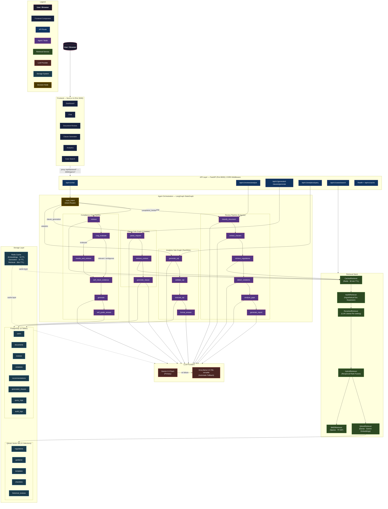

# ADGM Compliance Copilot — System Architecture

## Architecture Diagram



---

## Layer Descriptions

### Layer 1 — User

The end user accesses the platform through any modern browser. The frontend is the sole entry point; no backend services are exposed directly to the internet in the standard deployment.

---

### Layer 2 — Frontend (Next.js 14, Port 3000)

Built with Next.js 14 (App Router), TypeScript, Tailwind CSS, and shadcn/ui. Provides six purpose-built pages:

| Page | Route | Purpose |
|---|---|---|
| Dashboard | `/` | System health, recent activity, key metrics |
| Chat | `/chat` | Interactive compliance Q&A with source citations |
| Document Review | `/review` | PDF/DOCX upload triggering the 6-agent review pipeline |
| Clause Generator | `/clauses` | Natural language clause drafting with regulation citations |
| Analytics | `/analytics` | Natural language Text2SQL compliance reporting |
| Case Search | `/cases` | Semantic search over historical review database |

All API calls are proxied through the Next.js rewrite rule:

```
/api/backend/:path*  →  http://localhost:8000/api/v1/:path*
```

This means the browser never makes cross-origin requests directly to the FastAPI backend.

---

### Layer 3 — API Layer (FastAPI, Port 8000)

A FastAPI application serving as the interface between the frontend and all backend intelligence. CORS middleware is configured to allow requests from `http://localhost:3000`.

**Route Groups:**

| Route Group | Prefix | Description |
|---|---|---|
| Compliance Chat | `POST /api/v1/chat` | LangGraph intent-router entry point |
| Document Review | `POST /api/v1/reviews/analyze` | 6-agent compliance review pipeline |
| Clause Generator | `POST /api/v1/generated-clauses/generate` | AI clause drafting |
| Analytics | `POST /api/v1/analytics/query` | Text2SQL natural language analytics |
| Case Search | `POST /api/v1/cases/search` | Historical case similarity search |
| Health | `GET /health` | Infrastructure health check (Postgres, Qdrant, Redis) |
| Cache | `GET/DELETE /api/v1/cache` | Cache statistics and manual flush |

CRUD endpoints for `users`, `documents`, `violations`, `recommendations`, `audit_logs`, `query_logs`, and `generated_clauses` are also registered.

---

### Layer 4 — Agent Orchestration (LangGraph StateGraph)

The intelligence backbone of the platform. A LangGraph `StateGraph` compiles four capability pipelines into a single unified workflow. An intent-routing node (`route_intent`) classifies every incoming query using an LLM call and dispatches it to the correct sub-graph.

**Compliance Chat Pipeline (Phases 8, 14, 15)**

```
retrieve → crag_evaluate → [rewrite_and_retrieve →] self_check_evidence → generate → self_grade_answer
```

- `retrieve`: Calls the full retrieval stack to fetch top-K regulation chunks.
- `crag_evaluate`: Corrective RAG gate — scores retrieved context as relevant, ambiguous, or irrelevant.
- `rewrite_and_retrieve`: If context is irrelevant, rewrites the query and re-retrieves.
- `self_check_evidence`: Pre-generation self-RAG check — verifies evidence supports the question.
- `generate`: Gemini/Groq generates a cited, regulation-grounded answer.
- `self_grade_answer`: Post-generation self-RAG check — grades answer groundedness.

**Review Pipeline — 6 Agents (Phase 9)**

```
classify_document → extract_clauses → retrieve_regulations → detect_violations → analyse_gaps → generate_report
```

A strictly sequential pipeline where each agent builds on prior agent output to produce a scored compliance report with violations and recommendations.

**Clause Sub-Graph (Phase 10)**

```
parse_request → retrieve_context → generate_clause
```

Parses the user's plain-English clause request, retrieves matching ADGM regulations and templates, then generates a numbered, citation-backed legal clause.

**Analytics Sub-Graph — Text2SQL (Phase 12)**

```
generate_sql → validate_sql → execute_sql → format_answer
```

Converts natural language analytics questions into safe, validated SQL queries, executes them against PostgreSQL, and formats the results as a professional compliance narrative. Supports a human-in-the-loop preview mode.

---

### Layer 5 — Retrieval Stack

A layered retrieval architecture assembled from composable services. Each layer wraps the one beneath it, adding capability without changing the shared `Retriever` protocol interface.

```
CachedRetriever (Redis · 30 min TTL)
  └── HyDERetriever (Hypothetical Document Embedding)
        └── RerankedRetriever (LLM Listwise Re-ranking · candidate pool = 20)
              └── HybridRetriever (Reciprocal Rank Fusion)
                    ├── QdrantRetriever (Dense · Gemini embedding-001)
                    └── BM25Retriever (Sparse · rank-bm25)
```

| Component | Phase | Role |
|---|---|---|
| `QdrantRetriever` | Phase 5 | Semantic dense search across Qdrant collections |
| `BM25Retriever` | Phase 6 | Keyword-based sparse search using rank-bm25 |
| `HybridRetriever` | Phase 6 | Reciprocal Rank Fusion (RRF) merges dense + sparse results |
| `RerankedRetriever` | Phase 7 | LLM listwise re-ranker selects the best K from top-20 candidates |
| `HyDERetriever` | Phase 13 | Generates a hypothetical answer, embeds it for expanded query coverage |
| `CachedRetriever` | Phase 16 | Redis cache at the outermost layer; short-circuits the full stack on hits |

---

### Layer 6 — LLM Providers

**Primary: Google Gemini 2.0 Flash** (`gemini-2.0-flash`)
Used for all generation tasks: compliance answers, document classification, clause drafting, SQL generation, violation detection, CRAG evaluation, self-RAG grading, and LLM-based re-ranking.

**Embeddings: Gemini Embedding Model** (`gemini-embedding-001`)
Used exclusively for creating vector embeddings during ingestion and at query time. The embedding model is not subject to the Groq fallback.

**Fallback: Groq llama-3.3-70b-versatile** (`llama-3.3-70b-versatile`)
Activated automatically when Gemini returns any error (rate limit, quota exhaustion, API failure). The `GeminiClient` class handles the fallback transparently — all agent nodes see a single client interface.

---

### Layer 7 — Storage Layer

**Qdrant Vector Database (5 Collections)**

| Collection | Contents |
|---|---|
| `regulations` | Full text of ADGM regulations (FSMR, COBS, PRU, etc.) chunked and embedded |
| `guidance` | ADGM regulatory guidance notices and FAQs |
| `templates` | Standard-form templates for AoA, MoA, employment contracts, UBO declarations |
| `checklists` | Compliance checklists for licensing, AML/CFT, corporate governance |
| `historical_reviews` | Embeddings of past compliance review reports for similarity search |

**PostgreSQL (8 Tables)**

`users`, `documents`, `reviews`, `violations`, `recommendations`, `generated_clauses`, `query_logs`, `audit_logs`

**Redis Cache**

Three-tier caching strategy:
- **Embeddings**: 7-day TTL — avoids redundant calls to the Gemini embedding API
- **LLM generation**: 1-hour TTL — caches compliance answers and generated text
- **Retrieval results**: 30-minute TTL — short-circuits the entire retrieval stack on repeated queries
